# AI-DLC v2 Evaluator: Codex CLI Backend

**Base**: `awslabs/aidlc-workflows` `v2-evaluator`
**Fork**: `djoo-lgcns/aidlc-workflows` `feat/codex-cli-evaluator-backend`

이 문서는 upstream `v2-evaluator`에 대한 fork의 변경 목적과 효과를 다룹니다.
독자는 evaluator를 직접 실행하려는 개발자, 또는 이 변경을 upstream에 병합하는
maintainer입니다. Evaluator 외부의 orchestration(예: 실험 harness)이나 시나리오
설계는 다루지 않습니다.

---

## 목차

1. [문제 정의: upstream이 실행되지 않는 3가지 이유](#1-문제-정의-upstream이-실행되지-않는-3가지-이유)
2. [해결 요약: 5개의 좌표축을 따라 확장](#2-해결-요약-5개의-좌표축을-따라-확장)
3. [아키텍처: 컴포넌트와 데이터 흐름](#3-아키텍처-컴포넌트와-데이터-흐름)
4. [LLM 백엔드 shim (`shared/llm.py`)](#4-llm-백엔드-shim-sharedllmpy)
5. [ACP adapter (`kiro_acp.py`)](#5-acp-adapter-kiro_acppy)
6. [Turn boundary + Idle-timeout watchdog](#6-turn-boundary--idle-timeout-watchdog)
7. [Rules & dist provenance (`_setup_dist_from_rules`)](#7-rules--dist-provenance-_setup_dist_from_rules)
8. [Kiro CLI adapter 라우팅 (`kiro_cli.py`)](#8-kiro-cli-adapter-라우팅-kiro_clipy)
9. [상호작용 요약: 하나의 turn](#9-상호작용-요약-하나의-turn)
10. [사용법: CLI/환경 변수 인터페이스](#10-사용법-cli환경-변수-인터페이스)
11. [Observability & 검증](#11-observability--검증)
12. [Upstream 호환성](#12-upstream-호환성)
13. [파일별 변경 요약](#13-파일별-변경-요약)

---

## 1. 문제 정의: upstream이 실행되지 않는 3가지 이유

이 fork를 만든 근거는 upstream `v2-evaluator`가 세 가지 결합된 이유로 headless
CLI-driven A/B 실행에 실패한다는 것입니다.

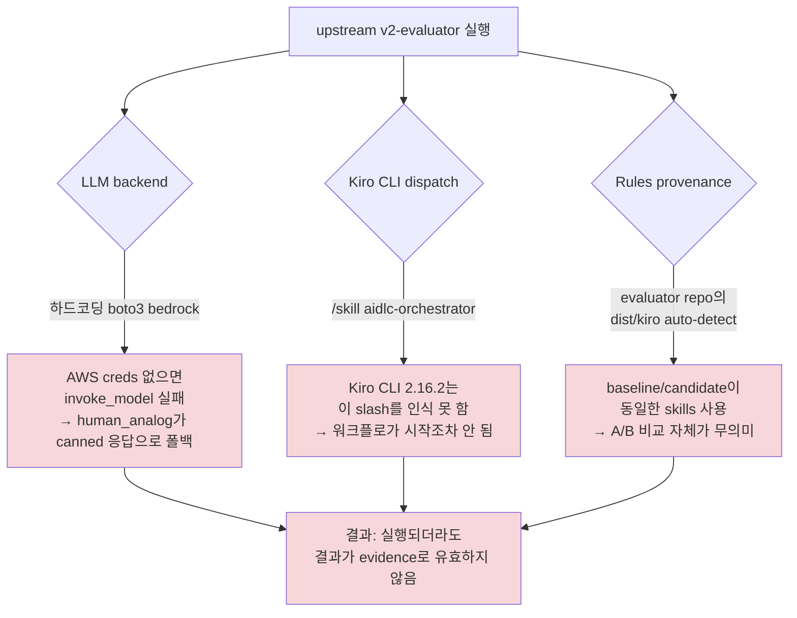

세 문제는 서로 독립이므로 세 좌표축을 따라 각각 확장합니다.

---

## 2. 해결 요약: 5개의 좌표축을 따라 확장

```mermaid
flowchart LR
    subgraph "1. LLM"
        A1[shared/llm.py 신규<br/>invoke_llm shim]
        A1 --> A2[bedrock backend 유지]
        A1 --> A3[codex-cli backend 신규]
    end

    subgraph "2. Kiro dispatch"
        B1[kiro_cli.py 재작성<br/>v2 워크스페이스 감지]
        B1 --> B2[/aidlc slash + v3 engine]
        B1 --> B3[ACP mode 기본, chat_watchdog fallback]
    end

    subgraph "3. Rules provenance"
        C1[_setup_dist_from_rules 신규]
        C1 --> C2[rules_ref별 sparse checkout]
        C1 --> C3[kiro-dist-manifest.txt<br/>SHA256 매니페스트]
    end

    subgraph "4. ACP protocol"
        D1[kiro_acp.py 신규]
        D1 --> D2[bidirectional JSON-RPC]
        D1 --> D3[permission / terminal / fs handlers]
        D1 --> D4[idle watchdog]
    end

    subgraph "5. Preflight & environment"
        E1[AWS preflight 조건부 skip]
        E1 --> E2[SSL_CERT_FILE + NODE_EXTRA_CA_CERTS 동기화]
        E1 --> E3[option-list fast-path in human_analog]
    end
```

각 축은 다음 절에서 자세히 다룹니다.

---

## 3. 아키텍처: 컴포넌트와 데이터 흐름

evaluator 하나의 실행(`run_cli_evaluation.py`)이 이룩하는 컴포넌트 배치:

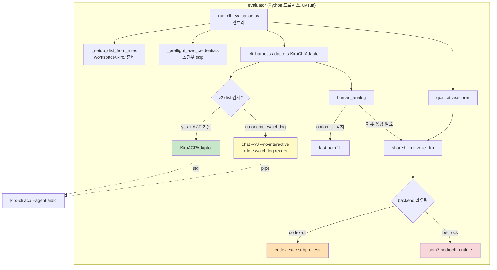

**핵심 원칙:** evaluator가 프로세스 경계를 3개 관리합니다.

1. **Kiro CLI 자체 (`kiro-cli acp`)** — workflow 실행 runtime. Evaluator가 stdio로 통신
2. **Codex CLI subprocess** — human_analog와 scorer의 LLM 호출용. Evaluator가 매 호출마다 spawn
3. **Kiro가 spawn하는 shell (bun/tsc 등)** — Kiro가 `terminal/create`를 request하면 evaluator가 subprocess로 실행

세 경계는 서로 fork되지 않으며 오염되지 않습니다.

---

## 4. LLM 백엔드 shim (`shared/llm.py`)

**변경 목적:** LLM 호출 지점을 backend에서 격리해서 Bedrock 이외의 backend(현재
Codex CLI)로 대체 가능하게 합니다.

**설계:**

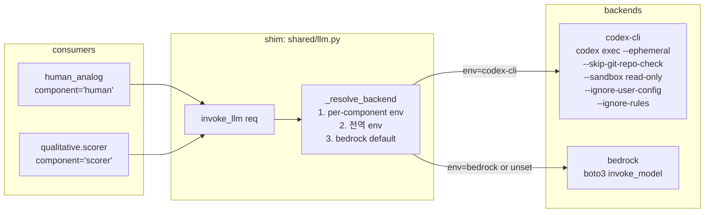

**Backend 결정 규칙 (per component):**

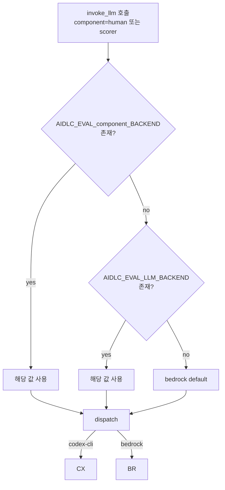

**Codex 호출 격리 특성:**

- `--ephemeral` — 매 호출이 새 프로세스, 세션/기억 공유 없음
- `--skip-git-repo-check` — 현재 workspace의 git 힌트 무시
- `--sandbox read-only` — Codex가 filesystem 조작 불가
- `--ignore-user-config` — `~/.codex/config.toml` 미사용
- `--ignore-rules` — 사용자 지정 rules 미사용
- `--output-last-message /tmp/<uuid>` — 각 호출별 고유 파일에 응답 저장

즉 하나의 evaluator 프로세스가 여러 번 Codex를 호출해도, 또는 여러 evaluator
프로세스가 동시에 Codex를 호출해도 상호 오염이 없습니다.

**Human analog의 fast-path:**

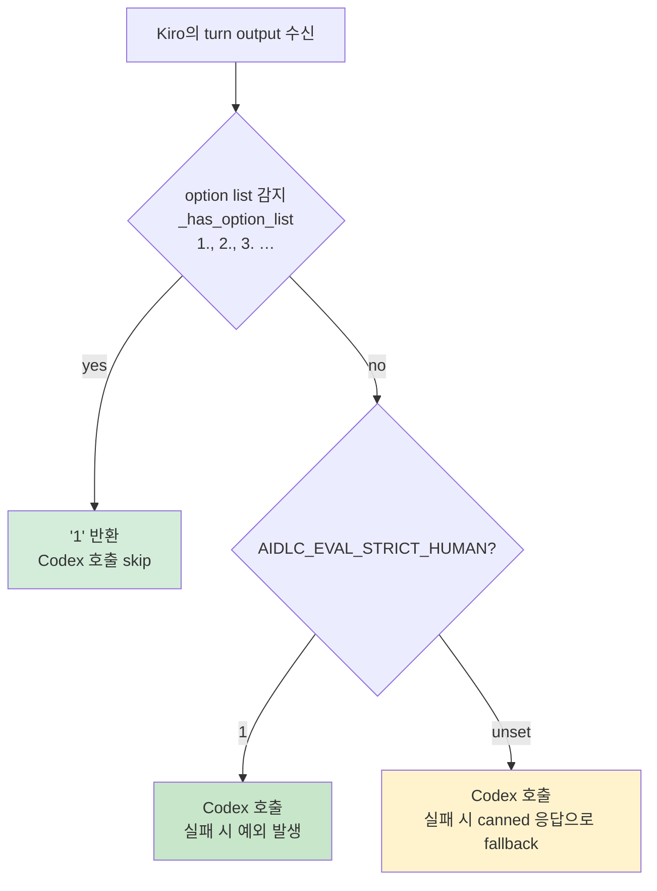

Strict mode(`AIDLC_EVAL_STRICT_HUMAN=1`)는 Bedrock 인증 실패 시 canned 응답으로
'성공한 것처럼' 지나가는 upstream 동작을 차단하는 방어 스위치입니다.

---

## 5. ACP adapter (`kiro_acp.py`)

**변경 목적:** Kiro CLI 2.16.2의 v3 agent engine과 통신할 수 있는 유일한
headless 인터페이스가 `kiro-cli acp` (Agent Client Protocol)입니다. 기존
`chat --no-interactive` 경로는 v3에서 non-interactive 지원이 문서상 없음이
확인됐고 stdout이 닫히지 않는 문제도 있습니다.

**ACP는 JSON-RPC 2.0 기반의 양방향 프로토콜**입니다. Agent가 클라이언트에게 permission
/ terminal / fs 요청을 되돌려 보내며, 클라이언트는 이를 처리해서 결과를 반환해야
합니다.

### 5.1 클래스 구조

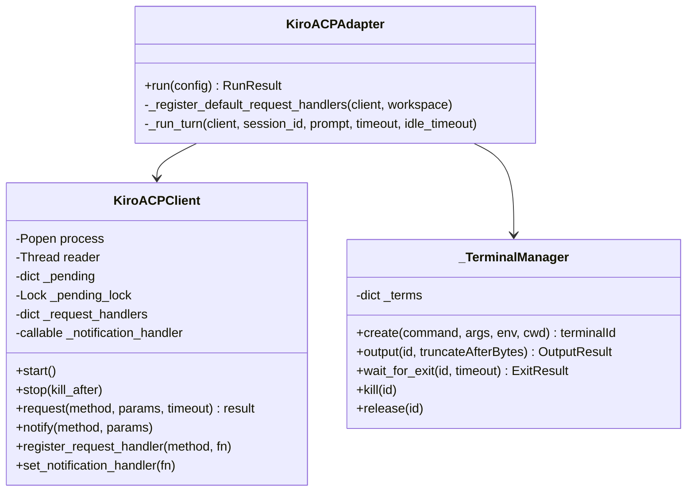

### 5.2 등록된 request handlers

Client는 다음 요청들에 응답합니다. 미등록 method는 JSON-RPC `-32601 Method not
found`를 반환하는 대신 우리 코드가 실제 handler를 제공합니다.

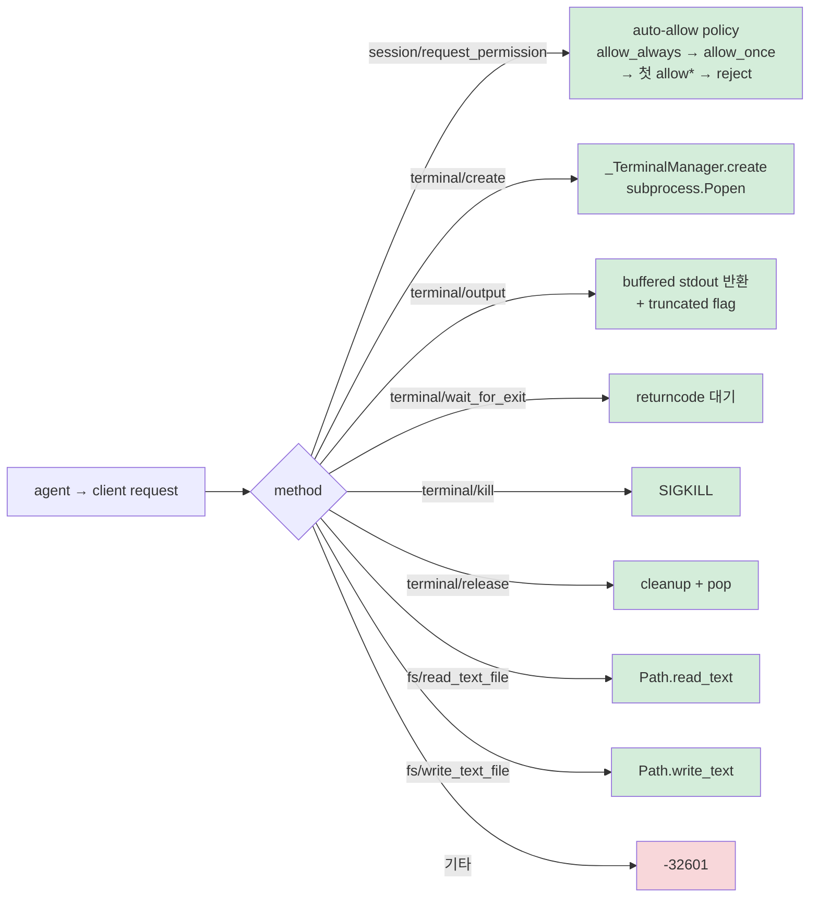

**Permission policy** (`session/request_permission`):

kiro-cli는 Kiro UI에서 사용자가 눌러야 할 버튼 리스트를 `options`로 보냅니다.
우리는 자동 선택을 위해:

1. `optionId=='allow_always'` 선택
2. 없으면 `optionId=='allow_once'` 선택
3. 없으면 `optionId`가 `allow`로 시작하는 첫 옵션 선택
4. 그마저도 없으면 reject 옵션 선택 (극히 드묾)

이는 evaluator에서만 안전합니다. 사용자 세션에서 이 정책을 그대로 적용하면 안 됩니다.

### 5.3 세션 초기화

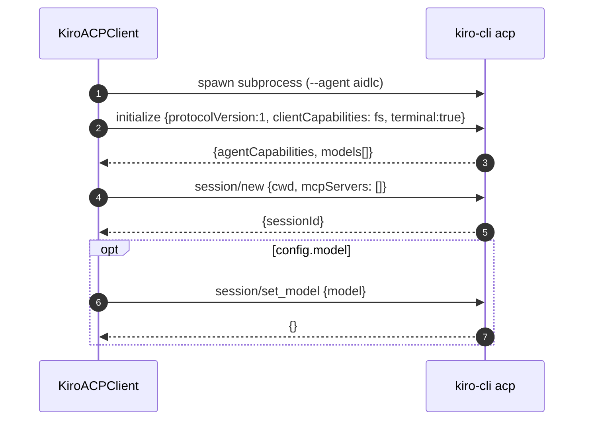

주의: ACP의 `session/prompt` params 필드명은 **`prompt`** 입니다. Kiro 문서 예시는
`content`로 표기하고 있으나 실제 코드는 `prompt`만 인식합니다.

---

## 6. Turn boundary + Idle-timeout watchdog

**변경 목적:** v2 workflow는 하나의 turn 안에서 sub-agent crew orchestration을
포함할 수 있어 turn 하나가 수십 분 걸릴 수 있습니다. 순진한 fixed timeout은
정상 진행을 wedged로 오인합니다. Idle-timeout watchdog은 침묵 여부로 진짜 hang을
분별합니다.

### 6.1 세 가지 종료 조건

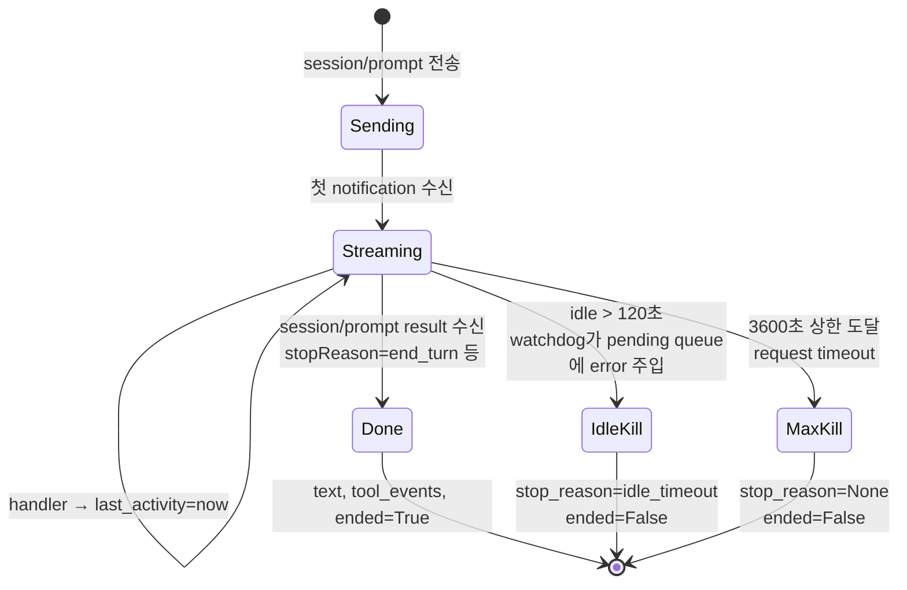

### 6.2 스레드 협업

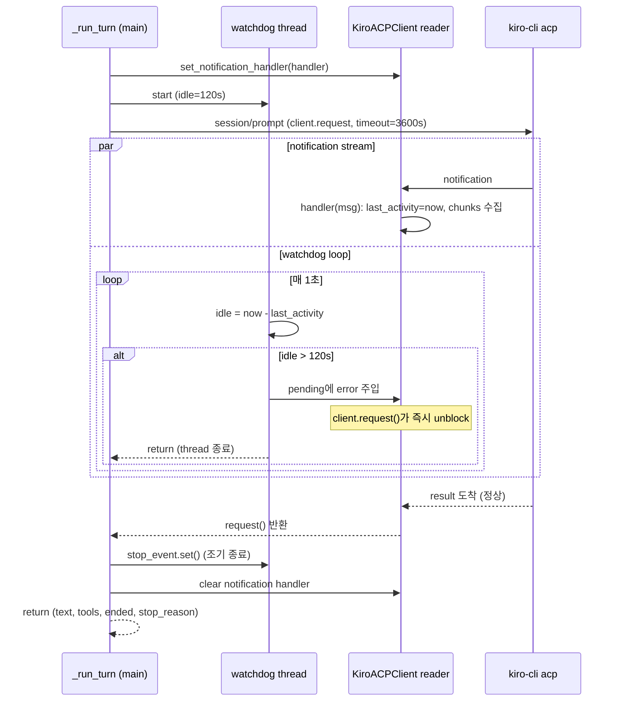

### 6.3 `agent_thought_chunk` silent drop

Kiro는 chain-of-thought partial text를 초당 5-10회 스트리밍합니다. 이는
`last_activity`를 refresh해 watchdog에 유용하지만 debug log를 오염시킵니다. Handler에서
silent drop합니다.

```python
def handler(msg):
    last_activity[0] = time.monotonic()   # 항상 갱신
    ...
    if update_type == "agent_thought_chunk":
        return   # 로그에 남기지 않음
    ...
    logger.debug("unhandled acp notification method=%s ...", ...)
```

---

## 7. Rules & dist provenance (`_setup_dist_from_rules`)

**변경 목적:** upstream은 `REPO_ROOT.parent.parent/dist/kiro/.kiro`에서 skills를
가져왔습니다. 이 경로는 evaluator repo 자체이므로 baseline과 candidate이 동일
버전의 skills를 사용합니다. A/B 결과가 무효화됩니다.

**해결:** `--rules-ref`가 지정하는 git ref에서 `dist/kiro/`를 **sparse checkout**으로
가져와 각 실행의 workspace에만 설치합니다.

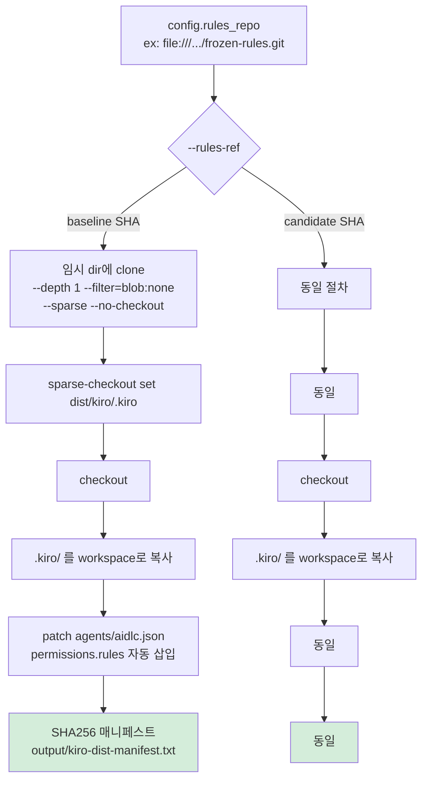

**우선순위:** `--kiro-dist` CLI 인자(있으면 그것 사용) → `_setup_dist_from_rules`
(rules_ref로부터 sparse) → 레거시 `REPO_ROOT.parent.parent/dist/kiro/.kiro` (있으면
WARN 로그로 사용).

**Provenance 검증:** 각 실행의 `output/kiro-dist-manifest.txt`에 설치된 모든
`.kiro/**` 파일의 SHA256이 기록됩니다. 서로 다른 rules_ref로 실행한 두 evaluator의
매니페스트를 비교해 skills 버전이 정확히 다름을 확인할 수 있습니다.

**Permission patch:** v3 agent engine은 `agents/*.json`의 `permissions.rules` 필드를
읽습니다. Evaluator는 이를 `[{capability: all, effect: allow}]`로 자동 설정합니다.
Legacy `allowedTools` (v2 필드)는 v3가 무시하므로 손대지 않습니다.

---

## 8. Kiro CLI adapter 라우팅 (`kiro_cli.py`)

**변경 목적:** v1 (`aidlc-docs/`)과 v2 (`aidlc/`) 두 workspace 레이아웃을 모두 감지하고,
v2일 때 ACP 어댑터로 라우팅합니다.

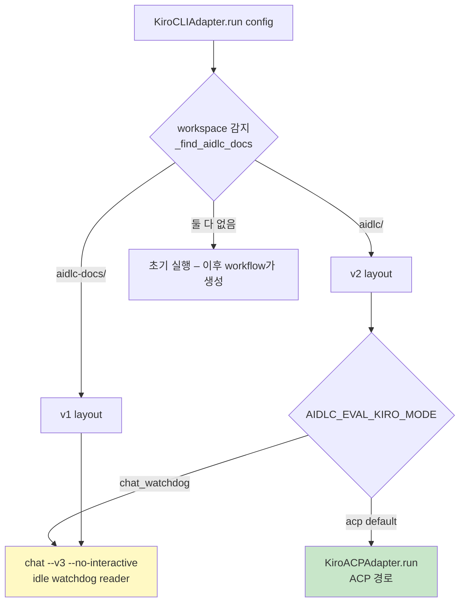

**Chat watchdog fallback** (`chat --v3 --no-interactive`):

- v3는 문서상 headless 미지원이지만 실제 실행은 됩니다
- stdout이 EOF 없이 닫히지 않고 프로세스가 defunct 상태가 됨
- 30초 idle timeout으로 SIGTERM/SIGKILL 처리 (`_run_v2_with_watchdog`)
- ACP가 안 될 때의 후속 옵션으로 유지

**Option list detection**: turn output이 numbered list 형식(`\n1.` `\n2.` `\n3.`)이면
approval 프롬프트로 분류하고 human_analog 호출을 skip합니다.

---

## 9. 상호작용 요약: 하나의 turn

evaluator가 하나의 turn을 진행하는 동안 세 프로세스 경계 사이의 트래픽:

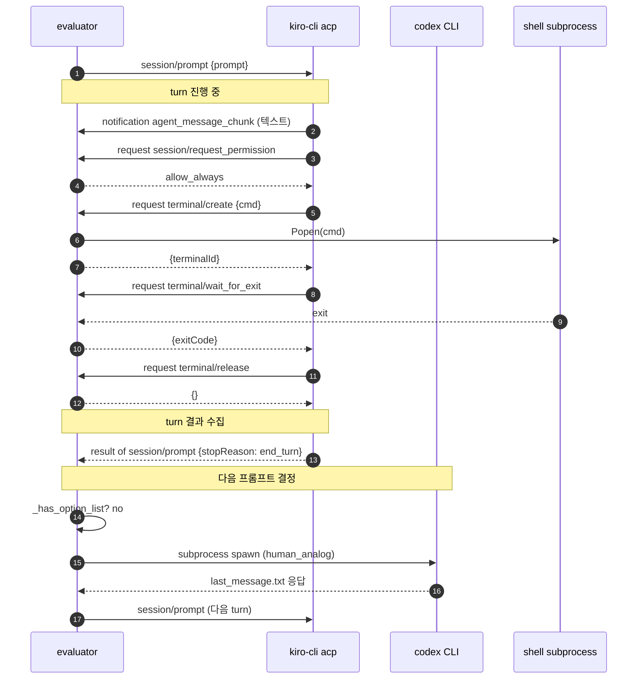

---

## 10. 사용법: CLI/환경 변수 인터페이스

### 10.1 환경 변수

| 변수 | 기본값 | 역할 |
| --- | --- | --- |
| `AIDLC_EVAL_LLM_BACKEND` | `bedrock` | 전역 backend (`codex-cli` 또는 `bedrock`) |
| `AIDLC_EVAL_HUMAN_BACKEND` | (상속) | human_analog 전용 override |
| `AIDLC_EVAL_SCORER_BACKEND` | (상속) | qualitative scorer 전용 override |
| `AIDLC_EVAL_STRICT_HUMAN` | (unset) | `1` 이면 human 응답 실패 시 canned 폴백 금지 |
| `AIDLC_EVAL_KIRO_MODE` | `acp` | `chat_watchdog`로 fallback 사용 가능 |
| `AIDLC_EVAL_CODEX_BIN` | auto-discovery | codex 바이너리 절대경로 지정 |
| `AIDLC_EVAL_SKIP_AWS_PREFLIGHT` | (unset) | `1` 이면 sts:GetCallerIdentity skip |
| `SSL_CERT_FILE` | (system) | Python/uv/Codex TLS 인증서 |
| `NODE_EXTRA_CA_CERTS` | (system) | Node/Kiro TLS 인증서 |

Codex 사용 시 위 두 backend env를 `codex-cli`로 두면 AWS preflight는 자동으로
skip됩니다.

### 10.2 CLI 인자 (`run_cli_evaluation.py`)

| 인자 | 의미 |
| --- | --- |
| `--cli kiro-cli` | 어댑터 선택 (현재 kiro-cli만 지원) |
| `--config CONFIG` | YAML 설정 파일 (rules_repo, models 등) |
| `--rules-ref REF` | 특정 branch/tag/SHA에서 skills를 sparse checkout |
| `--vision`, `--tech-env`, `--openapi` | 시나리오 입력 |
| `--model NAME` | agent에게 요청할 모델 이름 (`session/set_model`) |
| `--output-dir DIR` | workspace + reports 저장 위치 |
| `--kiro-dist PATH` | 직접 dist 경로 지정 (`_setup_dist_from_rules` 우회) |
| `--verbose` | DEBUG 로깅 활성화 |

### 10.3 최소 재현 명령

```bash
export AIDLC_EVAL_LLM_BACKEND=codex-cli
export AIDLC_EVAL_STRICT_HUMAN=1
export SSL_CERT_FILE=/path/to/corp_ca.pem
export NODE_EXTRA_CA_CERTS=/path/to/corp_ca.pem

cd scripts/aidlc-evaluator
uv run python run.py cli \
  --cli kiro-cli \
  --config /path/to/config.yaml \
  --rules-ref v2 \
  --vision /path/to/vision.md \
  --tech-env /path/to/tech-env.md \
  --openapi /path/to/openapi.yaml \
  --model claude-opus-4.8 \
  --output-dir /tmp/run-1 \
  --verbose
```

---

## 11. Observability & 검증

evaluator 하나의 실행이 남기는 evidence 파일:

| 파일 | 내용 | 검증 용도 |
| --- | --- | --- |
| `output/workspace/.kiro/**` | 설치된 skills, agents, tools | rules provenance |
| `output/kiro-dist-manifest.txt` | 모든 `.kiro/**`의 SHA256 | 정확한 rules_ref가 설치됐음을 확인 |
| `output/kiro-session.log` | ACP wire log (JSON-RPC 원본) | 어떤 request/notification이 오고 갔는지 정밀 분석 |
| `output/kiro-acp-stderr.log` | kiro-cli 프로세스의 stderr | kiro-cli 내부 오류 진단 |
| `evaluator.log` (호출자가 지정) | evaluator 자체 stdout+stderr | turn 진행, permission 결정, watchdog 발동 등 |
| `output/run-meta.yaml` | 시작/종료 시각, exit code, git SHA | 실행 메타 |
| `output/run-metrics.yaml` | turn 수, tool 호출 수, 응답 길이 등 | 정량 지표 |
| `output/report.md`, `report.html` | 사람이 읽는 리포트 | 결과 요약 |
| `output/test-results.yaml` | pytest 결과 | 정답성 |
| `output/quality-report.yaml` | 정적 분석 결과 | 코드 품질 |
| `output/contract-test-results.yaml` | OpenAPI contract 준수 | 인터페이스 정확성 |
| `output/qualitative-comparison.yaml` | scorer의 서술 평가 | 정성 |

**진짜 hang을 진짜 진행과 구별하는 방법:**

- `evaluator.log`에 `idle for Ns > 120.0s — treating as hang` 문구가 있으면 진짜 hang
- 없이 turn이 오래 걸린 것은 정상 (long sub-agent orchestration)

**A/B 두 실행이 다른 skills를 사용했음을 확인하는 방법:**

```bash
diff baseline/output/kiro-dist-manifest.txt candidate/output/kiro-dist-manifest.txt
```

예: `skills/aidlc/SKILL.md` 라인의 sha256이 서로 다르면 정상.

---

## 12. Upstream 호환성

이 fork는 다음 원칙으로 upstream 호환성을 유지합니다.

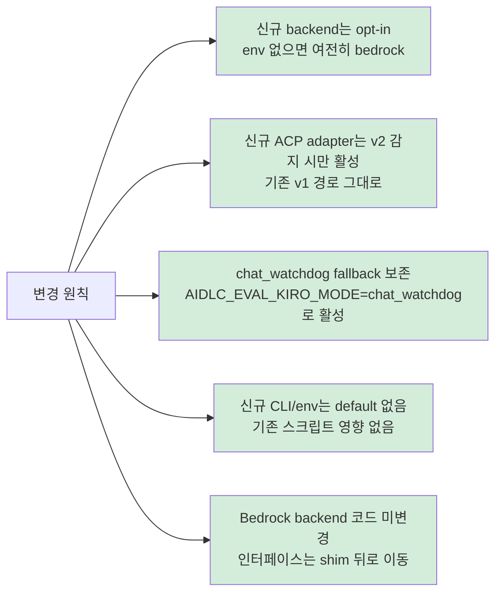

- **기존 사용자의 실행 스크립트는 변경 없이 동작**합니다 (Bedrock 가정)
- **새 사용자만 `AIDLC_EVAL_LLM_BACKEND=codex-cli`를 설정**하면 됩니다
- **ACP는 v2 workspace에서만 자동으로 사용**되고, `chat_watchdog`으로 opt-out 가능합니다

---

## 13. 파일별 변경 요약

| 파일 | 변경 종류 | 목적 |
| --- | --- | --- |
| `packages/shared/src/shared/llm.py` | **신규** | Backend 라우팅 shim (`invoke_llm`, `LlmRequest`) |
| `packages/cli-harness/pyproject.toml` | 수정 | `aidlc-shared` 의존성 추가 |
| `packages/ide-harness/pyproject.toml` | 수정 | 동일 |
| `packages/cli-harness/src/cli_harness/human_analog.py` | 재작성 | shim 사용, strict mode, option-list fast-path |
| `packages/ide-harness/src/ide_harness/human_analog.py` | 재작성 | 위와 동일 |
| `packages/qualitative/src/qualitative/scorer.py` | 재작성 | shim 사용 (`component="scorer"`) |
| `packages/cli-harness/src/cli_harness/adapters/kiro_cli.py` | 큰 폭 수정 | v2 감지, /aidlc slash, ACP 라우팅, chat watchdog |
| `packages/cli-harness/src/cli_harness/adapters/kiro_acp.py` | **신규** | ACP client + handlers + idle watchdog |
| `packages/cli-harness/src/cli_harness/prompt_template.py` | 문자열 제거 | `/skill aidlc-orchestrator` 삭제 |
| `scripts/run_cli_evaluation.py` | 수정 | `_setup_dist_from_rules`, `_preflight_aws_credentials` conditional |
| `scripts/run_ide_evaluation.py` | 수정 | 동일 preflight 조건 |
| `docs/EVALUATOR_ARCHITECTURE.md` | **신규 (이 문서)** | 아키텍처 및 변경 근거 문서 |

---

## 부록: 커밋 시리즈

Fork branch의 논리적 커밋 순서:

1. `feat(evaluator): fix v2 harness and add codex-cli LLM backend` — 골자 (shim + 초기 kiro_cli fixes)
2. `feat(cli-harness): invoke /aidlc slash via kiro-cli v3 agent engine`
3. `feat(cli-harness): detect v2 aidlc/ workspace layout`
4. `feat(cli-harness): treat numbered option lists as approval prompts`
5. `fix(cli-harness): import os for env-var diagnostics`
6. `feat(cli-harness): grant workspace aidlc agent v3 all-allow permissions`
7. `fix(cli-harness): tolerate v3 chat stdout not closing via idle timeout`
8. `feat(cli-harness): add kiro-cli ACP adapter stub (reserved for future use)`
9. `fix(cli-harness): handle bidirectional ACP with permission and terminal handlers`
10. `feat(cli-harness): route v2 workflows through the ACP adapter by default`
11. `fix(cli-harness): add idle-timeout watchdog and raise max turn timeout to 1h`
12. `fix(cli-harness): silence noisy agent_thought_chunk debug logs`

각 커밋은 rebase 없이 순차적으로 적용 가능하며, upstream `v2-evaluator`의 최신
tip에 conflicts 없이 병합 가능합니다.
